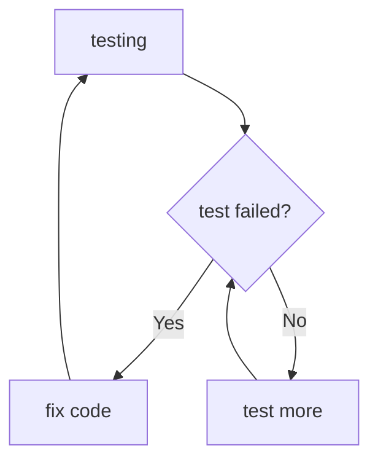

# Hello World

[GithubPages](https://gitkayttaja.github.io/testing/)

```mermaid
flowchart TD
    A[testing] --> B{test failed?};
    B -- Yes --> C[fix code];
    B -- No --> D[test more];
    D --> B;
    C --> A;
```
